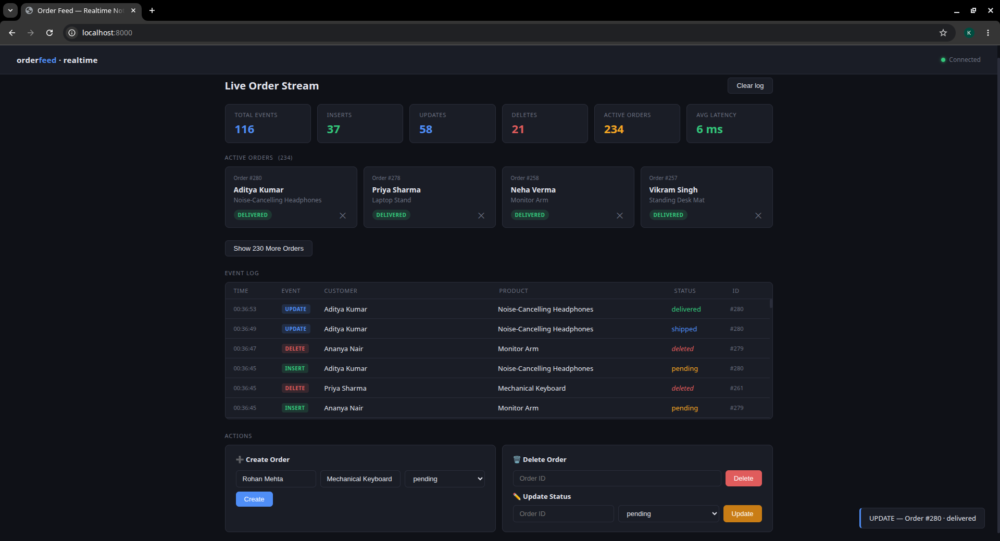

# Realtime Order Notifier

A real-time system that automatically pushes database changes to connected clients **without polling**.

Whenever an order is created, updated, or deleted:

**PostgreSQL → detects the change → Redis distributes the event → FastAPI WebSockets push updates instantly to connected clients**

Average end-to-end latency: **~5–10ms locally**

---

## Features

- Real-time order updates (**INSERT / UPDATE / DELETE**)
- PostgreSQL triggers + LISTEN/NOTIFY
- Redis Pub/Sub for horizontal scaling
- FastAPI WebSocket broadcasting
- REST APIs for CRUD operations
- Real-time frontend dashboard
- Connection filtering (`order_id`, `status`)
- Automatic reconnection handling
- Prometheus metrics endpoint
- Structured audit logging
- Dockerized setup
- Unit tests

---

## Architecture

```text
PostgreSQL
   ↓
DB Trigger
   ↓
LISTEN / NOTIFY
   ↓
Redis Pub/Sub
   ↓
FastAPI WebSocket Server
   ↓
Connected Clients
```

---

## Event Flow

1. Order is created, updated, or deleted
2. PostgreSQL trigger detects the database change
3. `pg_notify()` emits an event
4. FastAPI listener receives the event
5. Redis distributes the event across all server instances
6. WebSocket clients receive real-time updates instantly

---

## Why This Architecture?

### PostgreSQL Triggers
Captures database changes directly at the source.

Even if changes happen outside the API layer, clients still receive updates.

---

### Redis Pub/Sub
Enables horizontal scaling.

Without Redis:
only clients connected to one server instance would receive updates.

With Redis:
all server instances receive and broadcast updates.

---

### WebSockets
Provides real-time updates without polling overhead.

---

### Docker
Makes the project easy to run with one command.

---

## Project Structure

```text
├── assets
│   └── dashboard.png
├── client
│   └── index.html
├── docker-compose.yml
├── pytest.ini
├── README.md
├── requirements.txt
├── scripts
│   └── simulate.py
├── server
│   ├── api
│   │   ├── __init__.py
│   │   └── orders.py
│   ├── config.py
│   ├── db
│   │   ├── connection.py
│   │   ├── __init__.py
│   │   ├── listener.py
│   │   └── schema.sql
│   ├── Dockerfile
│   ├── main.py
│   ├── metrics.py
│   ├── pubsub
│   │   ├── __init__.py
│   │   └── redis_broker.py
│   ├── __pycache__
│   │   └── metrics.cpython-312.pyc
│   ├── requirements.txt
│   └── websocket
│       ├── __init__.py
│       ├── manager.py
│       ├── __pycache__
│       │   ├── __init__.cpython-312.pyc
│       │   └── manager.cpython-312.pyc
│       └── router.py
└── tests
    ├── conftest.py
    ├── __init__.py
    ├── __pycache__
    │   ├── conftest.cpython-312-pytest-8.3.4.pyc
    │   ├── conftest.cpython-312-pytest-9.0.3.pyc
    │   ├── __init__.cpython-312.pyc
    │   ├── test_connection_manager.cpython-312-pytest-8.3.4.pyc
    │   ├── test_connection_manager.cpython-312-pytest-9.0.3.pyc
    │   └── test_orders_api.cpython-312-pytest-8.3.4.pyc
    ├── test_connection_manager.py
    └── test_orders_api.py
```

---

## API Endpoints

| Method | Endpoint | Purpose |
|----------|------------|----------|
| POST | `/api/orders` | Create order |
| GET | `/api/orders` | Fetch all orders |
| PATCH | `/api/orders/{id}` | Update order |
| DELETE | `/api/orders/{id}` | Delete order |
| GET | `/health` | Health check |
| GET | `/metrics` | Prometheus metrics |
| WS | `/ws/orders` | Real-time WebSocket feed |

---

## WebSocket Filters

Clients can subscribe to:

- specific order IDs
- specific statuses

Example:

```bash
ws://localhost:8000/ws/orders?order_id=5
```

```bash
ws://localhost:8000/ws/orders?status=shipped
```

---

## Reliability Features

- PostgreSQL listener auto reconnects
- Redis subscriber auto reconnects
- WebSocket clients reconnect automatically
- Health checks for containers
- PostgreSQL payload size fallback handling

---

## Metrics & Monitoring

Tracks:

- Active WebSocket connections
- Database notifications received
- Redis publish events
- WebSocket broadcasts
- Event latency

---

## Testing

Implemented tests for:

- Order API CRUD flows
- WebSocket connection manager
- Filtering logic

Run tests:

```bash
pytest
```

---

## Run Locally

```bash
git clone https://github.com/Kushagra11Singh/Real-Time-Order-Notifier
cd realtime-order-notifier

cp .env.example .env

docker compose up --build
```

## Testing Real-Time Flow

Once the application is running, open:

```bash
http://localhost:8000
```

You can test real-time updates in two ways:

### Option 1: Automated Simulation

Run the simulation script to generate random order activity automatically:

```bash
python scripts/simulate.py
```

This continuously creates:

- new orders
- status updates
- delete events

You’ll see the dashboard update in real time through:

**PostgreSQL Trigger → Redis → WebSocket → Frontend**

---

### Option 2: Manual Testing

Use the dashboard controls to manually test:

- Create Order
- Update Order Status
- Delete Order

This helps verify individual flows manually.

---

### What You Should See

When testing:

- Active orders update instantly
- Event log updates in real time
- Insert / Update / Delete counters increase
- Average latency updates
- Toast notifications appear for each event
- Deleted orders disappear immediately from active orders list

## Dashboard Preview

Below is the live dashboard used to monitor real-time order activity:

- Active order tracking
- Real-time insert/update/delete events
- Event logs
- Latency monitoring
- Manual order actions
- WebSocket connection status


---

## Future Improvements

- JWT authentication
- durable event streaming (Kafka/RabbitMQ)
- missed-event replay
- rate limiting
- distributed tracing
